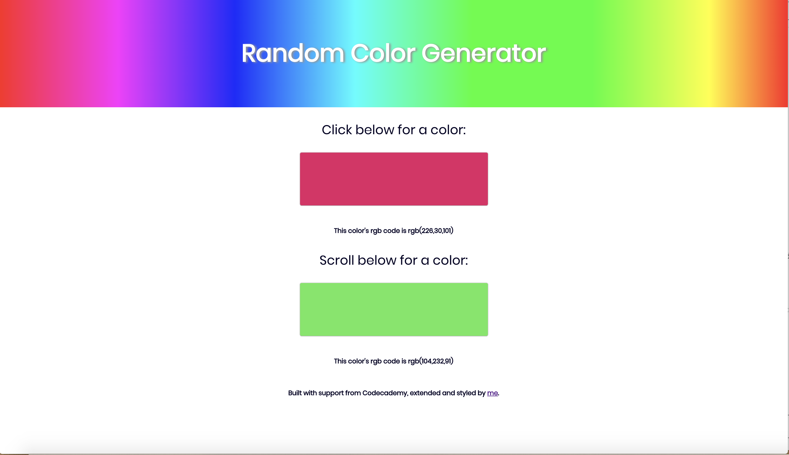

# Random Color Generator

I began this project following a webcast from Codecademy, then extended and styled it further on my own.

I replaced a rainbow image with a rainbow gradient background for the header.

I additionally added the ability to see the rgb code for each randomly generated color, making sure to define separate color change functions to keep the resulting RGB codes separate so as to correspond with the different colors in the buttons.
